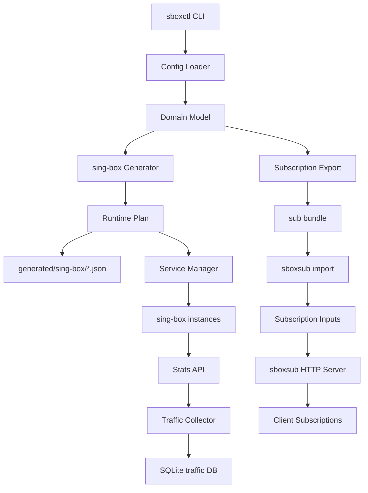

# sbox-manager 总体架构方案

## 1. 项目概述

`sbox-manager` 是一个围绕 sing-box 构建的代理管理系统，用单一 sing-box core 替代 `/Users/eagle/Sync/proxy/proxystack-go` 中 xray + clash/mihomo 的组合形态，并提供三类核心能力：订阅、实例管理、流量统计。

本项目目标是覆盖两个参考项目的功能点和运维经验，但不兼容旧配置格式、旧 CLI、旧订阅 bundle、旧 native backup 或旧 traffic SQLite schema。CLI 子命令集合在新语义下尽量贴近参考项目，降低使用习惯迁移成本。

## 2. 功能参考范围

参考来源：

- `proxystack-go`：`/Users/eagle/Sync/proxy/proxystack-go`，配置模型、stack 管理、sing-box 生成前的目标能力、订阅 HTTP 服务、bundle 安全导入、服务生命周期、安装更新、doctor、ipinfo、备份恢复。
- `xray traffic`：`/Users/eagle/.local/apps/init/tools/xray/traffic`，多实例流量采集、小时快照、每日聚合、每月聚合、年度展示、当前累计、watch、summarize、CSV 导出、保留期清理、定时任务。

非目标：

- 不迁移旧 `config.yaml` 或 `stacks/*.yaml`。
- 不保留 `ps-agent`、`ps-sub`、`xray-traffic` 二进制名。
- 不承诺 mihomo `load-balance`、`fallback` 的旧语义。
- 不读取旧 SQLite 数据库。

## 3. 二进制与职责边界

### 3.1 `sboxctl`

实例管理入口，负责：

- 初始化工作目录和全局配置。
- 管理 instance 配置。
- 生成 sing-box JSON。
- 执行 `sing-box check`。
- 写 runtime manifest。
- 管理 systemd/launchd 服务。
- 安装、更新、卸载 sing-box 和规则数据。
- 导出订阅 input 包。
- 采集、查询、聚合和导出流量数据。
- 执行 doctor、ipinfo、备份和恢复。

### 3.2 `sboxsub`

订阅服务入口，负责：

- 初始化订阅服务目录。
- 管理订阅输入文件。
- 导入 `sboxctl` 导出的订阅包。
- 启动 HTTP 订阅服务。
- 提供 Clash、Premium Clash、Surge、sing-box 订阅输出。
- 管理自身 systemd/launchd 服务。

`sboxsub` 不读取 `sboxctl` 的全局配置、instances、runtime manifest 或 traffic 数据。

## 4. 总体架构



## 5. 技术栈

- 语言：Go。
- CLI：Cobra。
- 配置加载：`gopkg.in/yaml.v3` + 强类型结构。
- HTTP：Go 标准库 `net/http`。
- 日志：Zerolog。
- 数据库：SQLite，使用 GORM 管理模型和迁移；启用 WAL、busy timeout 和 schema version。
- 依赖装配：显式构造函数和接口注入。
- 模板：Go 标准模板，不引入 pongo2。
- 服务管理：systemd、launchd。
- 测试：Go testing。

## 6. 配置模型

### 6.1 全局配置

```yaml
version: 1
external_host: proxy.example.com

paths:
  bin: bin
  rules: rules
  instances: instances
  runtime: runtime
  generated: runtime/generated
  publish: publish
  traffic: traffic
  downloads: downloads
  logs: logs

port_ranges:
  inbound: 24000-24999
  local_socks: 17000-17999
  local_http: 18000-18999
  api: 10000-10999

defaults:
  log_level: info
  api:
    enabled: true
    listen: 127.0.0.1:10085
  clash_api:
    enabled: false
    listen: 127.0.0.1:19090
  traffic:
    enabled: true
    timezone: Asia/Shanghai
    retention_days: 180
    daily_min_retention_days: 62
    monthly_retention_months: 36
    timeout_seconds: 30
    timer:
      hourly: "0 * * * *"
      daily: "10 0 * * *"
      monthly: "30 0 1 * *"

security:
  require_auth_for_public_socks_http: true
  allow_noauth_public: false
```

### 6.2 实例配置

```yaml
name: edge-us
enabled: true
role: edge
labels: [us]

api:
  enabled: true
  listen: 127.0.0.1:10085

inbounds:
  - name: vmess-main
    type: vmess
    listen: 0.0.0.0
    port: 24100
    users:
      - name: alice
        uuid: 11111111-1111-4111-8111-111111111111
    subscription:
      enabled: true
      user: alice
      remark: US VMess
      region: US

outbounds:
  - name: proxy-a
    type: shadowsocks
    server: server.example.com
    port: 443
    method: 2022-blake3-aes-256-gcm
    password: change-me

groups:
  - name: auto
    type: urltest
    outbounds: [proxy-a]
    url: http://www.gstatic.com/generate_204
    interval: 300

route:
  default: auto
  rules:
    - type: domain_suffix
      values: [google.com]
      outbound: auto

traffic:
  enabled: true
  scopes: [user, inbound, outbound]
```

### 6.3 详细数据契约

配置、订阅 input、订阅 bundle、agent backup、traffic DB、CSV 和服务文件字段以 [配置与数据规格](data-spec.md) 为准。

## 7. 模块划分

- `cmd/sboxctl`：实例管理 CLI。
- `cmd/sboxsub`：订阅服务 CLI。
- `internal/domain`：核心领域模型。
- `internal/config`：配置加载、默认值、校验、端口分配。
- `internal/generator/singbox`：sing-box JSON 生成器。
- `internal/runtime`：Runtime Plan、manifest、diff、原子写入。
- `internal/service`：systemd/launchd 服务管理。
- `internal/install`：下载、校验、安装、更新、卸载。
- `internal/subscription`：订阅 input、index、render、bundle。
- `internal/subserver`：订阅 HTTP server、watcher、鉴权。
- `internal/traffic`：stats client、baseline、SQLite repo、聚合与展示。
- `internal/diagnostics`：doctor、ipinfo、health check。
- `internal/backup`：新格式配置备份和恢复。

辅助工程文件：

- `Makefile`：本地测试、构建、打包和安装入口。
- `.github/workflows/release.yml`：tag release 自动构建和上传资产。
- `scripts/install.sh`：从 GitHub Release 安装二进制。
- `scripts/install-local.sh`：从本地构建产物安装二进制。

## 8. 实例管理设计

### 8.1 生成流程

1. 加载全局配置和 instance 配置。
2. 校验端口、公开监听安全、引用关系和规则目标。
3. 构造 sing-box 内部模型。
4. 生成稳定 JSON。
5. 执行 `sing-box check -c <generated-file>`。
6. 构造 Runtime Plan。
7. `check` 只预览 diff。
8. `start/restart` 原子写文件、更新 manifest、调用服务管理器。

### 8.2 Runtime Manifest

manifest 记录：

- manifest version。
- 全局配置 hash。
- instance 配置 hash。
- 生成时间。
- 生成文件路径、sha256、关联服务。

变更动作：

- `create`
- `update`
- `delete`
- `no-change`

Runtime Plan 只负责判断 create/update/delete/no-change 和目标服务集合，不自行决定用户显式生命周期动作。`start` 在 apply 成功后调用 service manager start；`restart` 是显式强制重启，即使 plan 为 no-change 也会在 `sing-box check` 通过后调用 service manager restart。

### 8.3 服务命名

- Linux/systemd sing-box 实例：`sbox@<instance>.service`
- Linux/systemd 订阅服务：`sboxsub.service`
- Linux/systemd traffic 定时器：
  - `sbox-traffic-hourly.timer`
  - `sbox-traffic-daily.timer`
  - `sbox-traffic-monthly.timer`
- macOS/launchd sing-box 实例：`com.sbox-manager.<instance>`
- macOS/launchd 订阅服务：`com.sbox-manager.sboxsub`
- macOS/launchd traffic 定时任务：
  - `com.sbox-manager.traffic.hourly`
  - `com.sbox-manager.traffic.daily`
  - `com.sbox-manager.traffic.monthly`

## 9. 路由与代理组设计

支持：

- `direct`
- `block`
- `selector`
- `urltest`
- 当前项目域 outbound 白名单：`direct`、`block`、`ref`、`shadowsocks`、`vmess`、`vless`、`anytls`、`trojan`、`hysteria2`、`socks5`、`http`。
- `ref` 是项目抽象类型，只能跨 instance 引用 `socks5` 或 `http` inbound，生成 sing-box 配置时解析为原生 `socks` 或 `http` outbound。

不兼容旧语义：

- mihomo 旧语义的 `load-balance`。
- mihomo 旧语义的严格优先级 `fallback`。

如果需要类似 fallback 的能力，使用 sing-box 支持的 selector、urltest 和 route 表达。旧项目语义无法等价映射时，配置校验失败并说明新模型中的替代表达。

## 10. 订阅设计

### 10.1 新订阅输入模型

订阅 input 是新 schema，不兼容旧 schema。

核心字段和校验规则见 [配置与数据规格](data-spec.md)。

订阅 node 支持：

- vmess。
- vless。
- anytls。
- shadowsocks。
- socks5。
- http。
- sing-box native node。native node 仅用于订阅 input/output，不是 `sboxctl` instance inbound/outbound 类型。

### 10.2 HTTP 路由

- `GET /health`
- `GET /clash/:user`
- `GET /clash/:token/:user`
- `GET /premium-clash/:user`
- `GET /premium-clash/:token/:user`
- `GET /surge/:user`
- `GET /surge/:token/:user`
- `GET /sing-box/:user`
- `GET /sing-box/:token/:user`

`access.type=none` 仅允许本地或受控环境使用；公网监听时 doctor 必须给出 ISSUE，公网部署建议强制 token。token 模式优先使用 path token，也允许 `?token=`。

### 10.3 热加载

启动时 input 非法则启动失败。

运行期 reload 失败时：

- 保留上一份可用 index。
- 记录 last_error。
- health 返回 error 状态但继续服务旧 index。

## 11. 流量统计设计

### 11.1 采集来源

sing-box V2Ray API 作为统计数据源，但不依赖 reset 语义。

使用 manager 自算 delta：

1. 读取当前累计计数。
2. 从 `traffic_baselines` 读取上次计数。
3. `delta = current - baseline`。
4. 如果 current 小于 baseline，判断为实例重启或计数重置，记录 `reset_detected=true`，delta 使用 current。
5. 写入 hourly 记录。
6. 更新 baseline。

### 11.2 数据表

使用表：

- `traffic_records`
- `traffic_baselines`
- `traffic_metadata`

字段、唯一键、索引、迁移策略和 CSV 字段见 [配置与数据规格](data-spec.md)。

### 11.3 命令

- `sboxctl traffic collect hourly --instance NAME|ALL`
- `sboxctl traffic collect daily --instance NAME|ALL [--date YYYY-MM-DD]`
- `sboxctl traffic collect monthly --instance NAME|ALL [--month YYYY-MM]`
- `sboxctl traffic show current --instance NAME|ALL`
- `sboxctl traffic show hourly|daily|monthly|yearly --instance NAME|ALL`
- `sboxctl traffic watch current --instance NAME|ALL`
- `sboxctl traffic summarize hourly|daily|monthly --instance NAME|ALL`
- `sboxctl traffic export hourly|daily|monthly --instance NAME|ALL --format csv`
- `sboxctl traffic list instances`
- `sboxctl traffic cleanup records`
- `sboxctl traffic check config|health`
- `sboxctl traffic edit config`
- `sboxctl traffic timer install|uninstall|enable|disable|status|logs`
- `sboxctl traffic timer run hourly|daily|monthly`

### 11.4 聚合规则

- hourly：从 API 当前累计与 baseline 差值生成。
- daily：从 hourly 聚合。
- monthly：从 daily 聚合。
- yearly：从 monthly 动态聚合，不落库。
- show 当前周期时追加当前未落库增量。
- `--instance ALL` 时追加跨实例小计。

### 11.5 保留期

- hourly：默认 180 天。
- daily：使用 `max(retention_days, daily_min_retention_days)`，默认不低于 62 天。
- monthly：默认 36 个月。

## 12. CLI 概览

详细命令规格见 [CLI 命令规格](cli-spec.md)。命令命名尽量贴近参考项目：

- `sboxctl` 对齐 `ps-agent` 的 agent 管理体验。
- `sboxsub` 对齐 `ps-sub` 的独立订阅服务体验。
- `sboxctl traffic` 对齐 `xray-traffic` 的 `collect/show/watch/summarize/export/list/cleanup/check/edit` 动词结构，并补充 systemd/launchd timer 管理入口。

通用全局参数：

- `--base-dir DIR`：指定 agent 或 sub 环境目录。
- `--service-manager auto|systemd|launchd`：默认 `auto`，Linux 解析为 `systemd`，macOS 解析为 `launchd`。
- `sboxsub --listen HOST:PORT`：覆盖订阅 HTTP 监听地址。

副作用边界：

- `check` 只做完整编译和 diff 预览，不写 runtime，不调用服务管理器。
- `start/restart` 先执行生成、`sing-box check` 和 runtime plan apply，再调用服务管理器。
- `restart` 是显式强制重启，no-change 时不改写 generated 或 manifest，但仍重启目标服务。
- `stop/status/logs/enable/disable` 只调用服务管理器，不写 runtime。

### 12.1 `sboxctl`

只读命令：

- `version`
- `list`
- `validate`
- `check`
- `render`
- `export-config`
- `doctor`
- `ipinfo`
- `sub validate-inputs`
- `traffic show`
- `traffic watch`
- `traffic summarize`
- `traffic list`
- `traffic check`

写配置命令：

- `setup local`
- `config`
- `add`
- `clone`
- `member add/remove`
- `remove`

写 runtime / 调服务命令：

- `start`
- `restart`

服务管理命令：

- `stop`
- `status`
- `logs`
- `enable`
- `disable`
- `service install`
- `service uninstall`
- `service start|stop|restart|status|enable|disable`
- `service logs|log`

下载安装命令：

- `setup`
- `install`
- `update`
- `uninstall`

订阅和备份命令：

- `sub export`
- `export`
- `import`

流量写入和调度命令：

- `traffic collect`
- `traffic export`
- `traffic cleanup`
- `traffic edit config`
- `traffic timer install|uninstall|enable|disable|status|logs|run`

### 12.2 `sboxsub`

- `init`
- `version`
- `config`
- `config show`
- `config check`
- `input list|show|validate|edit|clone|set-host|remove`
- `import`
- `clear`
- `serve`
- `service install|uninstall`
- `start|stop|restart|status|logs|enable|disable`
- `doctor`

## 13. 安全设计

- API 默认只监听 loopback。
- 非 loopback API 必须配置 token 或 secret。
- 公开 socks/http inbound 默认必须有鉴权。
- 日志禁止输出 token、password、UUID 明文和完整订阅内容。
- 内置下载源必须具备可信 checksum 元数据；自定义远端 URL 必须显式提供 sha256。
- zip/tar 解包必须拒绝绝对路径、`..`、反斜杠路径和未知成员。
- 外部命令必须使用参数数组执行，禁止拼接 shell 字符串。
- `check`、`render`、`validate`、`doctor` 必须保持只读。

## 14. 部署方案

默认目录：

- agent：`/opt/sbox-manager`
- sub：`/opt/sbox-sub`

目录结构：

```text
/opt/sbox-manager/
  bin/
  config.yaml
  instances/
  runtime/
  publish/
  traffic/
  rules/
  downloads/
  logs/

/opt/sbox-sub/
  config.yaml
  inputs/
  templates/
  logs/
```

同时验收 Linux/systemd 和 macOS/launchd。`--service-manager auto` 在 Linux 选择 systemd，在 macOS 选择 launchd；其他平台需要显式支持后才能使用 auto。

## 15. 备份恢复

备份只覆盖新项目 agent 配置：

- `config.yaml`
- `instances/*.yaml`
- `backup_manifest.json`

不包含：

- generated runtime。
- runtime manifest。
- traffic SQLite。
- downloads。
- logs。
- systemd/launchd 文件。
- sboxsub inputs。

恢复前必须完整校验 `backup_manifest.json`、hash 和目标覆盖策略。

## 16. 任务分解

1. 项目骨架与 CLI 基础。
2. 配置模型与校验。
3. sing-box 生成器与 Runtime Plan。
4. 实例生命周期与安装更新。
5. 订阅模型、bundle 和 HTTP 服务。
6. 流量统计与 SQLite。
7. doctor、ipinfo、备份恢复。
8. 测试矩阵和端到端验收。
9. Release、安装脚本与 Makefile。

## 17. 风险登记

| 风险 | 影响 | 处理 |
| --- | --- | --- |
| sing-box stats 输出格式变化 | traffic 采集失败 | 封装 StatsClient，增加 fixture 和版本检测 |
| 不兼容旧 load-balance 语义 | 用户迁移预期落差 | 文档明确不兼容旧语义，用新模型表达对应能力 |
| 规则转换复杂 | 路由行为偏差 | 使用新结构化 rule schema，不接收旧 Clash 文本规则 |
| 公开 API 暴露 | 管理面泄漏 | 默认 loopback，非 loopback 强制 token/secret |
| 订阅敏感信息泄漏 | 凭据泄漏 | show/log 默认脱敏 |

## 18. 领域术语

- instance：一个 sing-box 配置和运行服务实例。
- inbound：客户端连接入口。
- outbound：上游出站代理或直连目标。
- group：selector/urltest 等出站集合。
- subscription input：订阅节点输入文件。
- subscription index：按用户聚合后的订阅内存索引。
- traffic baseline：流量采集自算 delta 的上一轮累计值。
- runtime plan：本次生成物相对当前 manifest 的变化计划。

## 19. ADR

### ADR-001：使用 sing-box 单 core

决定：所有代理入口、出站选择、规则和统计都围绕 sing-box 生成。

后果：架构更简单，但不兼容 xray + mihomo 的双进程运行形态。

### ADR-002：不兼容旧项目格式

决定：参考旧项目功能，不兼容旧配置、CLI、bundle 和 DB。

后果：文档和开发可以围绕新模型设计，减少兼容层复杂度。

### ADR-003：traffic 使用 baseline 自算 delta

决定：不依赖 sing-box stats reset 语义。

后果：对 sing-box API 能力要求更低，但需要维护 baseline 表和 reset 检测。

### ADR-004：保留 agent/sub 边界

决定：`sboxctl` 和 `sboxsub` 分离。

后果：部署更清晰，订阅服务权限面更小。

### ADR-005：同时验收 systemd 和 launchd

决定：Linux/systemd 和 macOS/launchd 都纳入验收范围。

后果：服务管理抽象必须从一开始覆盖 systemd unit 和 launchd plist，测试需要提供两个后端的 fake 验收。

### ADR-006：SQLite 使用 GORM

决定：traffic SQLite schema 使用 GORM 管理模型和迁移。

后果：减少手写迁移成本，但需要在 Repository 层隔离 GORM 细节，避免领域层依赖 ORM。

### ADR-007：命令树贴近参考项目

决定：`sboxctl`、`sboxsub` 的命令命名尽量贴近 `ps-agent`、`ps-sub`，`sboxctl traffic` 贴近 `xray-traffic`。

后果：降低既有运维习惯迁移成本，但所有命令仍只接受新项目配置和数据格式。
